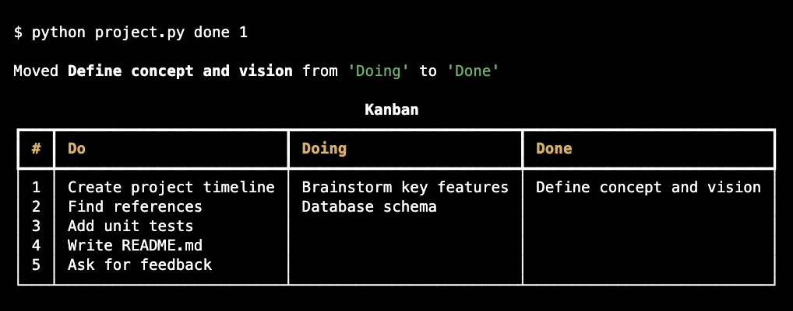

# `KanbanCLI`

<center></center>

#### Video Demo: https://youtu.be/getkVWNqNdg
#### Description:
KanbanCLI is a minimal command-line tool designed to provide a simple way to manage tasks using the Kanban methodology. With KanbanCLI, you can create and organize tasks into three columns: "Do," "Doing," and "Done." The program allows you to perform various actions such as adding tasks, moving them between columns, deleting tasks, and entering a focused mode for individual tasks. It is best suited for personal projects.
#### Future Implementation Ideas:
* Limit task characters
* Ability to limit the number of tasks in 'Doing' column
* Use objects for tasks to keep track of other related information
* Multiple boards

# `How to use?`

```console
$ python project.py [OPTIONS] COMMAND [ARGS]...
```

**Options**:

* `--help`: Show this message and exit.

**Commands**:

* `clear`: Clear all tasks from the board
* `delete`: Delete a task from a specific column
* `do`: Add a task to 'Do'
* `doing`: Move a task from 'Do' to 'Doing' || Use --back to move from 'Doing' back to 'Do'
* `done`: Move a task from 'Doing' to 'Done' || Use --back to move from 'Done' back to 'Doing'
* `focus`: Focus on a single task on 'Doing'
* `show`: Show the kanban board

## `python project.py clear`

Clear all tasks from the board

**Usage**:

```console
$ python project.py clear [OPTIONS]
```

**Options**:

* `--help`: Show this message and exit.

## `python project.py delete`

Delete a task from a specific column using task_id to specify the row.

**Usage**:

```console
$ python project.py delete [OPTIONS] COLUMN:{do|doing|done} TASK_ID
```

**Arguments**:

* `COLUMN:{do|doing|done}`: [required]
* `TASK_ID`: [required]

**Options**:

* `--help`: Show this message and exit.

## `python project.py do`

Add a task to the 'Do' column

**Usage**:

```console
$ python project.py do [OPTIONS] TASK
```

**Arguments**:

* `TASK`: [required]

**Options**:

* `--help`: Show this message and exit.

## `python project.py doing`

Move as task from the 'Do' column to 'Doing' column.
Use --back to move from 'Doing' column to 'Done' column

**Usage**:

```console
$ python project.py doing [OPTIONS] TASK_ID
```

**Arguments**:

* `TASK_ID`: [required]

**Options**:

* `--back / --no-back`: [default: no-back]
* `--help`: Show this message and exit.

## `python project.py done`

Move as task from the 'Doing' column to 'Done' column.
Use --back to move from 'Done' column to 'Doing' column

**Usage**:

```console
$ python project.py done [OPTIONS] TASK_ID
```

**Arguments**:

* `TASK_ID`: [required]

**Options**:

* `--back / --no-back`: [default: no-back]
* `--help`: Show this message and exit.

## `python project.py focus`

Enter 'Focus Mode' with a single task from the 'Doing' column

**Usage**:

```console
$ python project.py focus [OPTIONS] TASK_ID
```

**Arguments**:

* `TASK_ID`: [required]

**Options**:

* `--help`: Show this message and exit.

## `python project.py show`

Show the kanban board with # column as TASK_ID

**Usage**:

```console
$ python project.py show [OPTIONS]
```

**Options**:

* `--help`: Show this message and exit.
